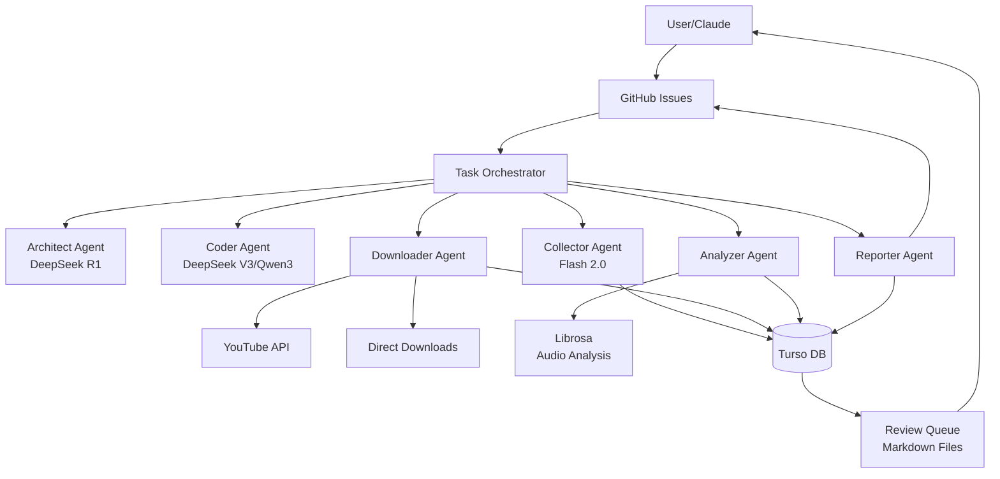
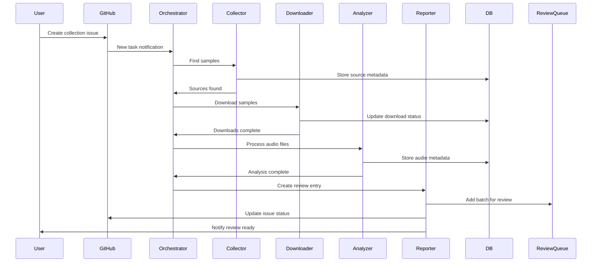

# SP404MK2 Sample Agent - Architecture

## System Overview

The SP404MK2 Sample Agent is a modular, AI-powered system designed to automate the discovery, collection, and organization of music samples for the SP404MK2 drum machine. The system uses multiple specialized agents coordinated through GitHub issues and a central database.

## Core Principles

1. **Modularity**: Each agent has a single, well-defined responsibility
2. **Cost Optimization**: Use the cheapest AI model that can handle each task
3. **Human Oversight**: All samples go through a review queue before production use
4. **Traceability**: Every action is logged and tracked through GitHub issues
5. **Fault Tolerance**: Agents handle errors gracefully and create issues for problems

## System Architecture



## Agent Specifications

### 1. Architect Agent (DeepSeek R1)

**Purpose**: System design and workflow optimization

**Responsibilities**:
- Analyze task requirements and design implementation approach
- Optimize agent interactions and workflows
- Propose system improvements based on performance data
- Create technical specifications for new features

**Triggers**:
- Epic creation
- System performance reviews
- Architecture decision records (ADRs)

### 2. Coder Agent (DeepSeek V3/Qwen3 Coder)

**Purpose**: Code implementation and maintenance

**Responsibilities**:
- Implement features designed by Architect Agent
- Fix bugs reported through GitHub issues
- Write and maintain tests
- Update documentation

**Triggers**:
- Implementation tasks from epics
- Bug reports
- Code review requests

### 3. Collector Agent (Google Flash 2.0)

**Purpose**: Discover and validate sample sources

**Responsibilities**:
- Search for samples based on criteria
- Validate URLs and availability
- Categorize content by style/genre
- Estimate download size and time

**Triggers**:
- Sample collection tasks
- Source discovery requests

### 4. Downloader Agent

**Purpose**: Retrieve samples from various sources

**Responsibilities**:
- Download from YouTube using yt-dlp
- Handle direct download links
- Convert to appropriate format (WAV, 44.1kHz, 16-bit)
- Retry failed downloads
- Report download statistics

**Error Handling**:
- 3 retry attempts with exponential backoff
- Create GitHub issue if download fails permanently
- Skip and continue with remaining samples

### 5. Analyzer Agent

**Purpose**: Audio analysis and organization

**Responsibilities**:
- Detect BPM using librosa
- Analyze key (when possible)
- Measure audio characteristics (duration, loudness)
- Organize files into BPM folders
- Generate audio fingerprints for duplicate detection

**Processing Pipeline**:
1. Load audio file
2. Detect tempo (BPM)
3. Analyze spectral characteristics
4. Move to appropriate folder
5. Update database with metadata

### 6. Reporter Agent

**Purpose**: Status updates and review queue management

**Responsibilities**:
- Update GitHub issue status
- Create review queue entries
- Generate progress reports
- Create error/bug issues
- Maintain audit logs

## Data Flow

### Sample Collection Workflow



## Database Schema

### Core Tables

```sql
-- Samples table: Core sample metadata
CREATE TABLE samples (
    id TEXT PRIMARY KEY DEFAULT (hex(randomblob(16))),
    source_url TEXT NOT NULL,
    youtube_id TEXT,
    title TEXT,
    artist TEXT,
    duration_ms INTEGER,
    file_path TEXT,
    file_size_bytes INTEGER,
    
    -- Audio characteristics
    bpm REAL,
    bpm_confidence REAL,
    key TEXT,
    
    -- Status tracking
    status TEXT NOT NULL DEFAULT 'pending',
    download_started_at TIMESTAMP,
    download_completed_at TIMESTAMP,
    analyzed_at TIMESTAMP,
    
    -- Review status
    review_batch_id TEXT,
    review_status TEXT,
    reviewed_at TIMESTAMP,
    reviewer_notes TEXT,
    
    -- Metadata
    created_at TIMESTAMP DEFAULT CURRENT_TIMESTAMP,
    updated_at TIMESTAMP DEFAULT CURRENT_TIMESTAMP,
    metadata JSON,
    
    FOREIGN KEY (review_batch_id) REFERENCES review_batches(id)
);

-- Tasks table: GitHub issue tracking
CREATE TABLE tasks (
    id TEXT PRIMARY KEY DEFAULT (hex(randomblob(16))),
    github_issue_id INTEGER UNIQUE,
    task_type TEXT NOT NULL,
    status TEXT NOT NULL DEFAULT 'pending',
    
    -- Task details
    source_url TEXT,
    style TEXT,
    bpm_range TEXT,
    target_count INTEGER,
    
    -- Execution tracking
    assigned_agent TEXT,
    started_at TIMESTAMP,
    completed_at TIMESTAMP,
    error_count INTEGER DEFAULT 0,
    last_error TEXT,
    
    -- Results
    samples_found INTEGER DEFAULT 0,
    samples_downloaded INTEGER DEFAULT 0,
    samples_analyzed INTEGER DEFAULT 0,
    
    created_at TIMESTAMP DEFAULT CURRENT_TIMESTAMP,
    updated_at TIMESTAMP DEFAULT CURRENT_TIMESTAMP
);

-- Review batches: Groups of samples for review
CREATE TABLE review_batches (
    id TEXT PRIMARY KEY DEFAULT (hex(randomblob(16))),
    task_id TEXT NOT NULL,
    batch_name TEXT NOT NULL,
    status TEXT NOT NULL DEFAULT 'pending',
    
    -- Statistics
    total_samples INTEGER DEFAULT 0,
    approved_samples INTEGER DEFAULT 0,
    rejected_samples INTEGER DEFAULT 0,
    
    created_at TIMESTAMP DEFAULT CURRENT_TIMESTAMP,
    reviewed_at TIMESTAMP,
    
    FOREIGN KEY (task_id) REFERENCES tasks(id)
);

-- Agent logs: Detailed operation tracking
CREATE TABLE agent_logs (
    id TEXT PRIMARY KEY DEFAULT (hex(randomblob(16))),
    agent_name TEXT NOT NULL,
    task_id TEXT,
    log_level TEXT NOT NULL,
    message TEXT NOT NULL,
    context JSON,
    created_at TIMESTAMP DEFAULT CURRENT_TIMESTAMP,
    
    FOREIGN KEY (task_id) REFERENCES tasks(id)
);

-- Create indexes for performance
CREATE INDEX idx_samples_status ON samples(status);
CREATE INDEX idx_samples_bpm ON samples(bpm);
CREATE INDEX idx_tasks_github_issue ON tasks(github_issue_id);
CREATE INDEX idx_agent_logs_task ON agent_logs(task_id);
```

## Configuration

### Agent Configuration (config/agents.yaml)

```yaml
agents:
  architect:
    model: "deepseek/deepseek-r1"
    temperature: 0.7
    max_tokens: 4000
    
  coder:
    models:  # Fallback order
      - "deepseek/deepseek-v3"
      - "qwen/qwen3-coder"
    temperature: 0.3
    max_tokens: 8000
    
  collector:
    model: "google/gemini-flash-2.0"
    temperature: 0.5
    max_tokens: 2000
    
  analyzer:
    bpm_detection:
      method: "librosa"
      tempo_range: [60, 180]
      confidence_threshold: 0.7
    
  downloader:
    youtube:
      format: "bestaudio"
      output_format: "wav"
      quality: "44100/16"
    retries: 3
    timeout: 300  # seconds
```

## Error Handling

### Error Categories

1. **Recoverable Errors**
   - Network timeouts
   - Rate limits
   - Temporary API failures
   
2. **Non-Recoverable Errors**
   - Invalid URLs
   - Deleted content
   - Authentication failures

### Error Response Strategy

```python
class ErrorHandler:
    def handle_error(self, error: Exception, context: dict):
        if self.is_recoverable(error):
            return self.retry_with_backoff(context)
        else:
            return self.create_error_issue(error, context)
```

## Security Considerations

1. **API Keys**: Stored in environment variables, never in code
2. **File Paths**: Sanitized to prevent directory traversal
3. **Downloads**: Limited file size and rate limiting
4. **Database**: Read-only access for most agents
5. **Review Queue**: Human approval before production use

## Performance Optimization

1. **Parallel Processing**: Multiple agents can work on different tasks
2. **Batch Operations**: Group database operations
3. **Caching**: Cache BPM detection results
4. **Resource Limits**: CPU and memory limits per agent
5. **Cost Optimization**: Use cheapest AI model for each task

## Monitoring and Observability

1. **Metrics**:
   - Samples processed per hour
   - Success/failure rates by agent
   - Average processing time
   - AI token usage and costs

2. **Logging**:
   - Structured logs to database
   - Error tracking with context
   - Performance profiling

3. **Alerts**:
   - Failed tasks after retries
   - Low success rates
   - High error rates
   - Cost threshold exceeded

## Future Enhancements

1. **Web UI**: Dashboard for monitoring and review
2. **Audio Preview**: In-browser sample preview
3. **ML Classification**: Auto-categorize samples by genre
4. **Duplicate Detection**: Audio fingerprinting
5. **Community Sharing**: Share curated sample packs