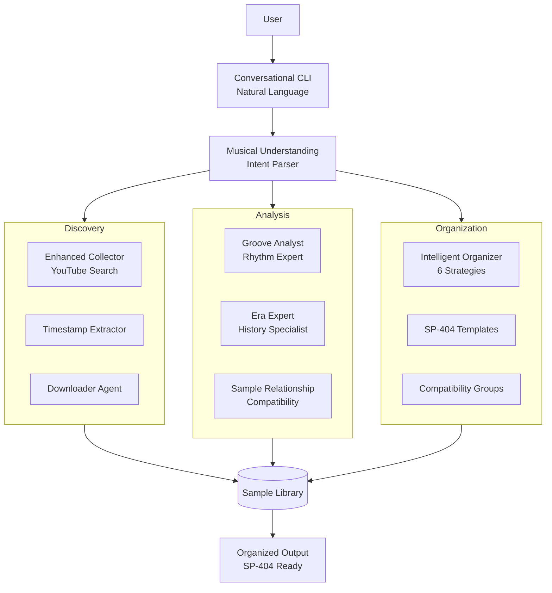
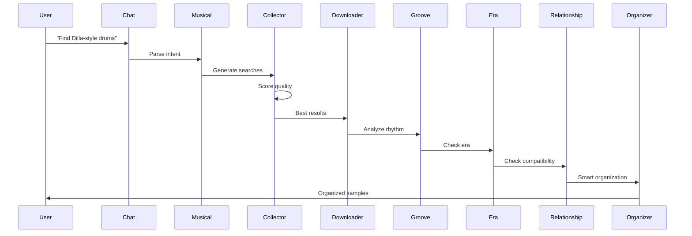

# SP404MK2 Sample Agent - Architecture

## System Overview

The SP404MK2 Sample Agent is a comprehensive AI-powered system for discovering, analyzing, and organizing music samples. It features a conversational interface, specialized analysis agents, and intelligent organization capabilities designed specifically for the SP404MK2 workflow.

## Core Principles

1. **Natural Language Interface**: Conversational discovery through chat
2. **Specialized Intelligence**: Each agent excels at specific musical analysis
3. **Musical Understanding**: Deep knowledge of production techniques and history
4. **Smart Organization**: Multiple strategies for library management
5. **SP-404 Optimization**: Built with the SP404MK2 workflow in mind

## System Architecture



## Component Architecture

### 1. Conversational Interface Layer

**SP404Chat** (`sp404_chat.py`)
- Natural language processing via Gemma-2-27B
- Streaming responses through OpenRouter
- Intent detection for automatic action execution
- Context-aware musical understanding

**Musical Understanding** (`src/chat/musical_understanding.py`)
- Parses natural language into structured queries
- Maps vibes, moods, and references to search terms
- Handles complex musical descriptions
- No expensive embeddings required

### 2. Discovery & Collection Agents

**Enhanced Collector Agent**
- Quality scoring system for YouTube results
- Era-specific search enhancement
- Producer style recognition
- Filters tutorials and non-sample content

**Timestamp Extractor**
- Parses video descriptions and comments
- Supports multiple timestamp formats
- Fire emoji (🔥) quality detection
- Precise segment extraction

**Downloader Agent**
- YouTube downloading via yt-dlp
- Direct URL support
- Format conversion and normalization
- Batch processing with retry logic

### 3. Analysis Agents

**Groove Analyst Agent**
```
Capabilities:
- BPM detection with confidence scoring
- Swing percentage calculation (50-80%)
- Groove type classification
- Artist similarity matching
- Micro-timing analysis
- Humanization scoring
```

**Era Expert Agent**
```
Knowledge Base:
- 1950s-2010s production techniques
- Equipment and studio knowledge
- Genre-specific characteristics
- Modern recreation tips
- Search query enhancement
```

**Sample Relationship Agent**
```
Analysis Types:
- Harmonic compatibility (key relationships)
- Rhythmic compatibility (BPM, groove)
- Frequency compatibility (spectral overlap)
- Energy compatibility (dynamics)
- Overall scoring and recommendations
```

### 4. Organization System

**Intelligent Organizer**
```
Strategies:
1. Musical Properties (BPM/Key/Type)
2. Genre & Era (Historical grouping)
3. Groove Style (Rhythmic characteristics)
4. Compatibility (Samples that work together)
5. SP-404 Banks (Performance-ready layouts)
6. Project-Specific (Workflow optimization)
```

**SP-404 Templates**
- Hip-Hop Kit: Standard production layout
- Live Performance: Song sections and FX
- Finger Drumming: Optimized pad placement

## Data Flow

### Complete Discovery Workflow



## Agent Specifications

### Groove Analyst Agent

**Purpose**: Deep rhythm and timing analysis

**Key Features**:
- Swing percentage detection (50% = straight, 67% = triplet swing)
- Artist reference matching (Dilla, Questlove, Metro Boomin, etc.)
- Groove classification (boom bap, trap, swing, etc.)
- Micro-timing analysis for humanization
- Production tips based on groove type

**Algorithm Overview**:
```python
# Simplified swing detection
def calculate_swing(onset_times):
    # Analyze 8th note pairs
    ratios = []
    for i in range(0, len(pairs), 2):
        first = pairs[i+1] - pairs[i]
        second = pairs[i+2] - pairs[i+1]
        ratio = first / (first + second)
        ratios.append(ratio)
    
    # 50% = straight, 67% = triplet
    return mean(ratios) * 100
```

### Era Expert Agent

**Purpose**: Musical production history and era detection

**Knowledge Structure**:
```yaml
1950s-1960s:
  equipment: [Ampex tape, Neumann U47, EMT plates]
  techniques: [Live to 2-track, minimal overdubs]
  signature: Warm midrange, mono/narrow stereo
  
1970s:
  equipment: [Neve 8078, SSL 4000, Minimoog]
  techniques: [16/24 track, heavy compression]
  signature: Analog warmth, wide stereo
  
1990s:
  equipment: [MPC2000/3000, SP-1200]
  techniques: [Vinyl sampling, bit reduction]
  signature: Filtered highs, boom bap punch
```

### Sample Relationship Agent

**Purpose**: Musical compatibility analysis

**Scoring Matrix**:
| Interval | Semitones | Score | Relationship |
|----------|-----------|-------|--------------|
| Unison | 0 | 10/10 | Perfect match |
| Perfect 5th | 7 | 9/10 | Strong support |
| Perfect 4th | 5 | 8.5/10 | Stable |
| Relative minor | 9 | 7/10 | Natural pairing |
| Tritone | 6 | 3/10 | Maximum tension |

### Intelligent Organizer

**Purpose**: Smart sample library management

**Organization Strategies**:

1. **Musical Properties**
   ```
   drums/uptempo_90-120/Cmaj/
   bass/slow_60-70/Amin/
   ```

2. **SP-404 Banks**
   ```
   SP404_Bank_A/
     A01_kick_90bpm_Cmaj.wav
     A02_snare_90bpm_Cmaj.wav
   ```

3. **Compatibility Groups**
   ```
   compatible_group_1/
     [samples with 7+ compatibility]
   ```

## Database Schema

### Extended Schema for New Features

```sql
-- Musical analysis results
CREATE TABLE musical_analysis (
    id TEXT PRIMARY KEY,
    sample_id TEXT NOT NULL,
    analysis_type TEXT NOT NULL, -- 'groove', 'era', 'relationship'
    
    -- Groove analysis
    swing_percentage REAL,
    groove_type TEXT,
    timing_feel TEXT,
    closest_artist_reference TEXT,
    
    -- Era analysis  
    detected_era TEXT,
    era_confidence REAL,
    key_equipment JSON,
    
    -- Compatibility scores
    compatibility_pairs JSON,
    
    created_at TIMESTAMP DEFAULT CURRENT_TIMESTAMP,
    FOREIGN KEY (sample_id) REFERENCES samples(id)
);

-- Organization plans
CREATE TABLE organization_history (
    id TEXT PRIMARY KEY,
    strategy TEXT NOT NULL,
    input_samples JSON,
    organization_plan JSON,
    execution_stats JSON,
    created_at TIMESTAMP DEFAULT CURRENT_TIMESTAMP
);
```

## Configuration

### Agent Models Configuration

```yaml
conversational:
  model: "google/gemma-2:27b-it"
  temperature: 0.7
  streaming: true
  
analysis:
  model: "google/gemini-flash-2.0"
  temperature: 0.3
  
organization:
  strategies:
    - musical
    - genre  
    - groove
    - compatibility
    - sp404
    - project
  
sp404_templates:
    - hip_hop_kit
    - live_performance
    - finger_drumming
```

## Performance Optimization

1. **Batch Processing**: Analyze multiple samples concurrently
2. **Caching**: Store analysis results to avoid reprocessing
3. **Quick Mode**: Faster analysis with reduced accuracy
4. **Selective Analysis**: Only run needed agents
5. **Streaming UI**: Immediate feedback in chat interface

## Error Handling

### Graceful Degradation
- Missing audio libraries: Use mock analysis
- No database: Continue without persistence
- API failures: Retry with exponential backoff
- Invalid samples: Skip and continue

### User-Friendly Errors
```python
try:
    result = await analyze_groove(files)
except AudioLibraryError:
    return "Audio analysis unavailable - using estimates"
except Exception as e:
    return f"Analysis failed - {user_friendly_message(e)}"
```

## Security Considerations

1. **API Keys**: Environment variables only
2. **File Access**: Sandboxed to project directories
3. **User Input**: Sanitized in chat interface
4. **Downloads**: Size and rate limited
5. **Organization**: Confirm before moving files

## Monitoring and Observability

### Key Metrics
- Samples discovered per search
- Analysis accuracy (when ground truth available)
- Organization efficiency
- User satisfaction (successful discoveries)

### Logging Strategy
- User interactions logged for improvement
- Agent decisions tracked for debugging
- Performance metrics for optimization
- Error patterns for reliability

## Future Architecture Enhancements

1. **Web Interface**: Browser-based sample management
2. **Real-time Collaboration**: Multi-user sample sharing
3. **Cloud Storage**: Direct integration with cloud services
4. **Mobile Companion**: iOS/Android remote control
5. **AI Sample Generation**: Create new samples from descriptions
6. **Community Marketplace**: Share and trade sample packs

## Development Guidelines

### Adding New Agents
1. Extend the base `Agent` class
2. Implement `execute()` method
3. Add to agent registry
4. Create test script
5. Document in agent-specific guide

### Adding Organization Strategies
1. Add strategy to `IntelligentOrganizer.strategies`
2. Implement organization method
3. Update documentation
4. Add to test suite

### Extending Musical Understanding
1. Add patterns to intent detection
2. Expand genre/mood mappings
3. Test with real user queries
4. Update examples in docs